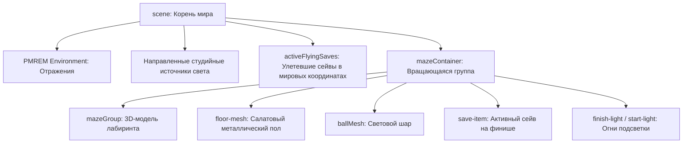

# Подробное руководство по проекту: Holobox Gyro Labyrinth 3D

Это руководство описывает архитектуру, физический движок, сетевой пайплайн, устройство 3D-сцены и логику работы игры.

---

## 1. Суть проекта и правила игры

### 1.1. Назначение и формат
Проект разработан для специализированного вертикального 3D-экрана **4K Holobox** (соотношение сторон 9:16). Игра создает иллюзию физического стеклянного короба, внутри которого катается металлический шар.

### 1.2. Игровой процесс (Геймплей)
* **Режим игры**: Time Attack (игра на время).
* **Задача игрока**: Собрать **6 сейв-дисков** за **60 секунд**.
* **Уровни**: Игра состоит из 6 последовательных лабиринтов (`labirint2.fbx` – `labirint7.fbx`), отображаемых на экране как **ЛАБИРИНТ 02 — 07**.
* **Как играть**:
  1. Пользователь сканирует QR-код на экране Holobox своим смартфоном.
  2. Смартфон открывает страницу контроллера и сопрягается с ПК.
  3. Игрок наклоняет смартфон вперед/назад и влево/вправо.
  4. Шар катится по лабиринту под действием наклона гравитации.
  5. При нахождении шара на сейв-диске, сейв улетает в небо, уровень сменяется на следующий через красивый 0.6-секундный фейд-эффект.
  6. При сборе 6 сейвов игрок побеждает. Если время (60 сек) истекает, игра завершается выводом статистики.

---

## 2. Устройство 3D-сцены (Three.js)

Все графические элементы сцены распределены по иерархическим группам для обеспечения правильной работы наклонов и анимаций:



### 2.1. Группа `mazeContainer` (Центр вращения)
* Все элементы лабиринта (стены, пол, шар, финишные огни) помещаются внутрь группы `mazeContainer`.
* Центр `mazeContainer` расположен в точке `(0, 0, 0)`.
* При наклоне телефона вращается **только** `mazeContainer` по осям Pitch (тангаж) и Roll (крен). Это создает визуальный эффект наклона короба с лабиринтом перед глазами пользователя.

### 2.2. Разделение Сейв-Мешей (`save-item`)
* **Активный сейв**: Находится внутри `mazeContainer` на координатах финиша конкретного уровня, вращается и покачивается на месте.
* **Улетевшие сейвы (`activeFlyingSaves`)**: При контакте с шаром сейв переносится в корневой объект `scene`. Это выводит его из локальных координат `mazeContainer` — улетевшие сейвы **не наклоняются** вместе с лабиринтом и остаются висеть в мировом пространстве над коробкой, пока лабиринт под ними меняется и крутится.

---

## 3. Физический движок (Rapier3D WASM)

Физика работает на скомпилированном в WebAssembly движке Rapier3D. Для достижения идеальной стабильности и реализма применены три ключевых решения:

### 3.1. Трюк с вектором гравитации (Gravity Tilting)
Физическая 3D-модель лабиринта (`mazeBody`) создается как **неподвижный статический объект** (`fixed`). Он никогда не вращается и не перемещается в физическом мире.
Вместо этого наклоны смартфона преобразуются в **наклон вектора глобальной гравитации**:
```typescript
physicsWorld.gravity = {
  x: targetRoll * gravityStrength,
  y: -35.0,
  z: targetPitch * gravityStrength
};
```
* **Плюс**: Это дает 100% стабильную симуляцию столкновений. Шар никогда не провалится сквозь стены и не «застрянет» при резких движениях, поскольку физические коллизии рассчитываются на неподвижной сетке.

### 3.2. Вращение по оси Z/Yaw (Компенсация ориентации телефона)
Чтобы шар катился точно туда, куда пользователь наклоняет телефон, независимо от того, в какую сторону направлен нос смартфона, вектор гравитации корректируется на угол рыскания (`currentYaw`):
```typescript
const rawGx = currentRoll * gravityStrength;
const rawGz = currentPitch * gravityStrength;
physicsWorld.gravity = {
  x: rawGx * cosYaw - rawGz * sinYaw,
  y: -35.0,
  z: rawGx * sinYaw + rawGz * cosYaw
};
```

### 3.3. Физический аккумулятор (Physics Accumulator)
Для стабильного прохождения сквозь кадры на мониторах с разной частотой обновления (например, 30 Гц у Holobox и 144 Гц на ПК разработчика) физика работает на фиксированном шаге симуляции:
```typescript
physicsAccumulator = Math.min(physicsAccumulator + dt, PHYSICS_TIMESTEP * MAX_PHYSICS_STEPS_PER_FRAME);
while (physicsAccumulator >= PHYSICS_TIMESTEP) {
  physicsWorld.step();
  physicsAccumulator -= PHYSICS_TIMESTEP;
}
```
Это гарантирует, что скорость качения шара будет одинаковой на любом дисплее.

---

## 4. Сетевое взаимодействие (WebSockets)

Обмен данными происходит по следующему пайплайну:

```
[ Смартфон ] ──(Гироскоп: beta, gamma)──> [ Node.js HTTPS-сервер ] ──> [ Holobox ПК ]
```

1. **Автоматический SSL**: Сервер `server.js` на ПК генерирует самоподписанный SSL-сертификат для локального IP-адреса. Мобильные браузеры дают доступ к API гироскопа (`DeviceOrientation`) **только** по безопасному протоколу `https://`.
2. **Паринг по QR**: На экране Holobox отрисовывается QR-код, содержащий адрес `https://<IP-компьютера>:3000/controller.html`. Смартфон сканирует его и подключается к сокет-комнате.
3. **Безопасность подключения**: При подключении нового телефона старая сессия автоматически отключается на сервере для избежания конфликта управления несколькими устройствами.
4. **Передача данных**: Данные отправляются в режиме `volatile` (без подтверждения доставки), обеспечивая задержку менее 8 миллисекунд.

---

## 5. Процедурный звук (Web Audio API)

В игре нет аудиофайлов. Все звуки генерируются математически в реальном времени:
* **Качение (Rolling sound)**: Постоянный белый шум, пропущенный через `BiquadFilterNode` (Bandpass). Частота и громкость звука динамически изменяются в зависимости от текущей скорости шара. При остановке звук полностью затухает.
* **Удар (Impact sound)**: Код постоянно измеряет векторное ускорение шара. В случае резкого торможения запускается синусоидальный генератор на низкой частоте (около 120 Гц) с быстрым затуханием, имитируя глухой удар тяжелого шара об деревянный/пластиковый борт.
* **Победа (Victory chime)**: Синтезируется мажорный арпеджио-аккорд с использованием треугольной волны и эффекта эха (delay feedback).

---

## 6. Структура папок и файлов проекта

```
phone-gyro-control/
├── server.js                 # HTTP/HTTPS & WebSocket Node.js сервер
├── index.html                # Основной HTML-интерфейс игры (HUD, экраны победы)
├── package.json              # Зависимости проекта (Three.js, Rapier3D, Vite, Socket.io)
│
├── src/
│   ├── desktop.ts            # Главный скрипт игры (Three.js, физика, логика, сокеты)
│   ├── desktop.css           # Стили десктопного интерфейса
│   ├── controller.ts         # Логика мобильного контроллера
│   └── common.css            # Общие стили проекта
│
├── public/                   # Статические ассеты (копируются в dist/ при сборке)
│   ├── source/
│   │   ├── new/              # Модели уровней: labirint2.fbx - labirint7.fbx
│   │   └── save.fbx          # 3D-модель золотого сейв-диска
│   └── textures/             # PBR-текстуры для стен и пола лабиринта
│
└── scripts/
    └── generate_labirint2.py # Blender Python скрипт для модульной сборки лабиринтов
```
